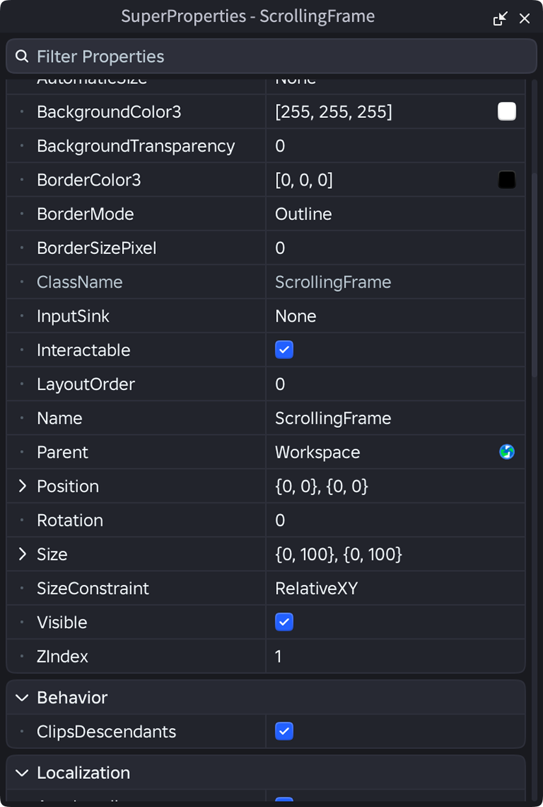

# Superproperties

A custom properties explorer for roblox.

> [!WARNING]
> Superproperties is a work in progress. Not all properties currently support being written to.

## TODOs

### Core
- [ ] Implement `ColorSequence` and `NumberSequence` property values.
- [ ] Implement `BrickColor` property values.
- [ ] Implement `EnumItem` property values.
- [ ] Implement `Instance` property values.
- [ ] Implement `PhysicalProperties` property values.
- [ ] Implement multi-instance select.

### Bonus Features
- [ ] Tabs to filter between the selected instances.
- [ ] The ability to bookmark properties for easy access.
- [ ] The ability to quickly change the class of an Instance directly in the properties explorer.
- [ ] A token/variable system, define a value once - use it across many properties.
