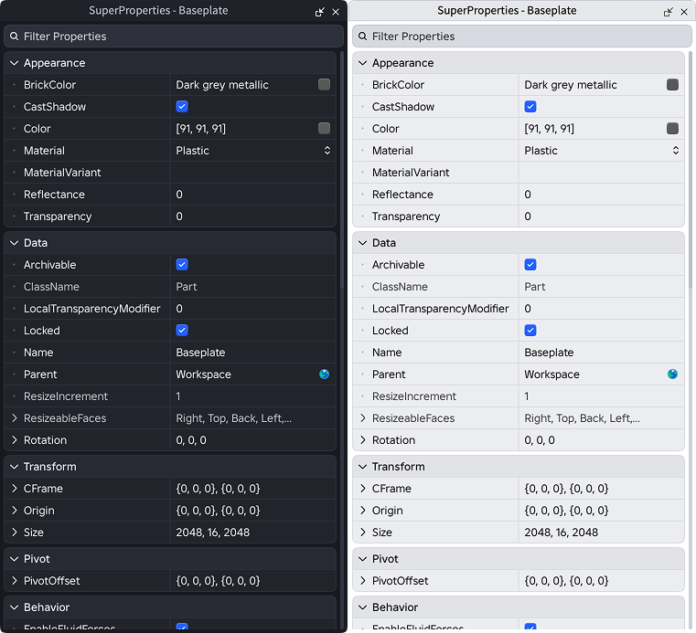

# Superproperties

A custom properties explorer for roblox.

## Installation
Install the `rbxm` from the [latest release](https://github.com/cameronpcampbell/superproperties/releases/latest) to your local plugins folder.

## TODOs

### Core
- Implement `ColorSequence` and `NumberSequence` property values.
- Implement `BrickColor` property values.
- Implement `PhysicalProperties` property values.
- Implement `Font` property values.
- Implement `Content` property values.

### Fixes
- Address minor performance issues with the virtual list.

### Bonus Features
- Tabs to filter between the selected instances.
- The ability to quickly change the class of an Instance directly in the properties explorer.
- A token/variable system, define a value once - use it across many properties.
